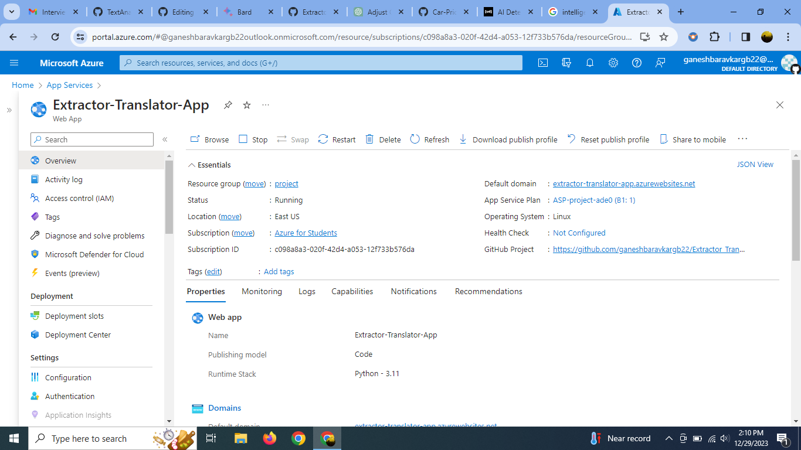

<h1>Microsoft-Future-Ready-Talent-Virtual-Internship-Project</h1>
<h2>Project Title: Extractor-Translation-App</h2>
<b><a href="https://extractor-translator-app.azurewebsites.net/">Extractor-Translation-App</a></b>
 
<h2>Project Details</h2>
<b>Project Demo URL : https://extractor-translator-app.azurewebsites.net/ </b>  
<b>Demo Video URL : https://drive.google.com/drive/folders/1Vxm2UwsahOpHrnsOJnCSisMXWquhCRJ4?usp=drive_link </b> 
<b>Github Repository URL : https://github.com/ganeshbaravkargb22/Extractor_Translator_App </b>  
<b>Industry : Lifestyle and Intelligence Technology </b> 
<h2>Azure Services Used</h2>
<h3>Azure AI Service </h3> 
<b>1. Azure AI Custom (Computer) vision Service : To perform optical character recognition(OCR) and extract text from images or documents.</b> 
<b>2. Azure AI Translator Service: Utilized for text translation into multiple languages.</b>   
<h3>Core Azure Services:</h3>
<b>1. Azure App Service: Deployed  the streamlit Web App on Azure Cloud Portal.</b> 
<b>2. Azure Monitor Metrics service: Metrics used Performance Monitoring and creating the custom Dashboard for Azure services.</b> 

<h2>Problem Statement</h2>
<b>
The Extractor-Translation Web App is key to unlocking information in any language. It effortlessly extracts key points from text, translates them accurately, and presents them in a user-friendly format. It is a translator and guiding  through diverse texts with ease. This app is built for real-time exploration, handling large data. Remove the language barriers and dive into a world of understanding. The Extractor-Translation Web App is  discovery! Whether a student seeking global knowledge or a business navigating international markets, this app empowers you to break down barriers and connect with the world like never before.
</b>

<h2>Project Description</h2>
<b>

To develop a web application that seamlessly extracts text from images and documents, translates it into multiple languages, and presents the results in an intuitive user interface, powered by Azure's cognitive services, Azure AI service and deployed on a scalable cloud platform.

<b>Technologies :</b>
<ul>
    <li>Azure Custom (Computer) Vision Service for text extraction.</li>
    <li>Azure Translator Service for language translation.</li>
    <li>Streamlit framework for building the user interface.</li>
    <li>Azure Web App Service for deployment.</li>
    <li>Azure Monitor Metrics measure (CPU)performance and usages .</li>
    </ul>
  
<b>Key Features :</b>
<ul>
    <li>User-friendly interface: Streamlit enables a straightforward and interactive experience for users.</li>
    <li>Flexible input: Supports both image and document uploads for text extraction.</li>
    <li>Multilingual translation: Leverages Azure Translator Service to translate extracted english text into a wide range of languages.</li>
    <li>Streamlined workflow: Offers a seamless process from image/document upload to translated text output.</li>
    <li>Azure Monitor Metrics: Create custom dashboards and reports using Metrics Explorer for comprehensive insights.</li>
    </ul></b>

<b><h2>Core Azure Services</h2>
<b>Azure App Service:</b> 
Hosts the python backend to process user requests and provide text manipulation functionalities.

<b>Azure Monitor Metrics Service:</b> 
 Metrics used Performance Monitoring for App Service,AI services.

<h2>Azure AI Service</h2>
<b>Azure AI Translator Service:</b> 
Our translation functionality is powered by the highly advanced Azure AI Translator service. This service utilizes state-of-the-art natural language processing algorithms to provide precise translations for an extensive range of languages and contexts.

<b>Azure AI Custom(Computer) Vision Studio (OCR) Service:</b> 
Azure AI Computer Vision service is a powerful and versatile tool for extracting text from images and documents. It can automate data entry, digitize processes, and unlock valuable insights from text-based content.

<h2>Other Azure Technologies / Services</h2>
<b>Azure Key Vault: </b> 
Securely manages keys, secrets, and certificates used in the application.
</b>

<h2>Screenshots</h2>

<h3>Azure AI Computer Vision Service</h3>
<b>Description:

The service can extract text from images,Documents enabling applications to recognize and process text in various languages.
</b>
</img> 

<b>

It takes in any type of document or images written in English and is sent to the service to extract data from it

Inside Custom/Computer Vision Studio under the Optical Character Recognition , the feature Extract Text from Image is used to do the work of getting any complicated written text from the different formates.
</b>
</img> 

<h3>Azure AI Translator Service</h3>
<b>Description:

The Azure Translator Service is utilized to translate the extracted text into a desired target language.
Language translation is performed seamlessly, providing multilingual support and enabling the understanding of text content across language barriers.
</b>
</img> 

<h3>Azure App Service</h3>
<b>Description:

Integrating the "Extract Text from Image and Translate" functionality into an Azure Web App Service involves creating a web application that users can interact with through a browser. Users upload an image through the web interface, and the server processes the image, extracts text, and translates it.

</img></b> 

<h3>Azure Monitor Metrics Service</h3>
<b>Description:

Azure Monitor can be used for monitoring and creating dashboards  
    
dashboards in the Azure portal to visualize key metrics, logs, and performance indicators. This allows you to have a centralized view of the health and performance of your "Extractor_Translator_App" application. 

Azure Monitor Service to Monitor the performance of your web application, identifying slow response times, dependency calls, and other performance-related issues. This helps in optimizing the user experience.

</img></b> 

<h3>Dashboard: </h3>

</img></b> 

<h3>Resource Visualizer</h3>
<b>Description:
Attached herewith is the resource visualizer screenshot, presenting an overview of the utilized resources for reference and documentation purposes.</b>

</img> 

<h3>Working Live Project Display</h3>
<b>Description:
I am providing the enclosed screenshot of the finalized operational website for your reference and review purposes.</b>
 

<b>How To Use steps :
<ul>
    <li>Click on the Browse file option .</li>
    <li>Select the image or document.</li>
    <li>After extraction of the text,Select the language for the translation of the extracted text.</li>
    </ul></b>
</img>

<h3>Extracted Text</h3>
</img> 

<h3>Translated Text</h3>
</img> 

<h2>Final Project Statement</h2>
<b>

The "Extractor_Translator_App" project, leveraging Azure services, presents a robust solution for overcoming language barriers and enhancing accessibility to textual content within images. The integration of Azure AI Computer Vision Service, specifically the Computer Vision API for text extraction and the Translator Text API for language translation, empowers the project with powerful AI capabilities. 
</b>

